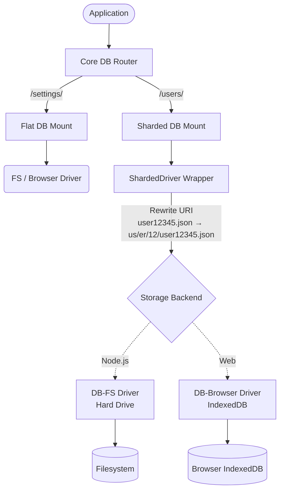

# Sharded Driver Architecture

Драйвер для роботи з sharded сховищем, розроблений для подолання обмежень файлових систем та IndexedDB `db-browser` щодо обмеження кількості збережених об'єктів/файлів у межах однієї плоскої директорії чи store.

## Архітектура: Взаємодія вузлів (Mounts & Drivers)



## Декларативна конфігурація (YAML/.nano)

Архітектура Model-as-Schema розроблена так, щоб її можна було легко ініціалізувати з конфігураційних файлів (`.nano` або `.yaml`), уникаючи хардкоду і дозволяючи гнучке налаштування:

```yaml
# db.yaml
mounts:
  "/schemas/":
    driver: fs
    root: "./data/schemas"

  "/users/":
    driver: sharded
    chars: 2
    depth: 3
    storage:
      driver: fs    # Використовуємо db-fs для бекенду
      root: "./.cache/shards/users"
      
  "/analytics/":
    driver: sharded
    chars: 2
    depth: 2
    storage:
      driver: browser # Використовуємо db-browser для web
      name: "nan0_analytics_store"
```

## Програмна реалізація (JavaScript)

Як конфігурація вище транслюється у код для Backend (`@nan0web/db-fs`) та Frontend (`@nan0web/db-browser`):

### Приклад для Backend (DB-FS)

```javascript
import { DB, ShardedDriver } from '@nan0web/db'
import { FSDriver } from '@nan0web/db-fs'
import { resolve } from 'node:path'

const db = new DB()

// 1. Ініціалізуємо базовий драйвер з абсолютним шляхом (обов'язково!)
const shardsRoot = resolve(process.cwd(), '.cache/shards/users')
const storage = new FSDriver({ root: shardsRoot })
await storage.connect()

// 2. Створюємо ShardedDriver, який обгортає базовий
const shardedDriver = new ShardedDriver({ 
  driver: storage, 
  chars: 2, 
  depth: 3 
})

// 3. Монтуємо через ізольований екземпляр DB.
// root має відповідати shardsRoot для правильної генерації absolute() шляхів.
const usersDB = new DB({ root: shardsRoot })
usersDB.driver = shardedDriver

db.mount('/users/', usersDB)

// Використання:
// Зберігає у файл: .cache/shards/users/us/er/12/user12345.json
await db.saveDocument('/users/user12345.json', { role: 'admin' })
```

### Приклад для Web (DB-Browser)

Для браузера принцип залишається ідентичним. Змінюється лише кінцевий `storage`. Ідентично до файлової системи, `IndexedDB` також може зіткнутися з падінням продуктивності при великій кількості записів у "плоскому" сховищі, тому шардинг є актуальним і для web.

```javascript
import { DB, ShardedDriver } from '@nan0web/db'
import { BrowserDriver } from '@nan0web/db-browser' // Driver for IndexedDB

const db = new DB()

// 1. Ініціалізуємо браузерний драйвер
const storage = new BrowserDriver({ name: 'nan0_analytics_store' })
await storage.connect()

// 2. Створюємо ShardedDriver (наприклад, 2 символи, 2 рівні)
const shardedDriver = new ShardedDriver({ 
  driver: storage, 
  chars: 2, 
  depth: 2 
})

// 3. Монтуємо на префікс /analytics/
const analyticsDB = new DB()
analyticsDB.driver = shardedDriver

db.mount('/analytics/', analyticsDB)

// Використання:
// Зберігає під записом: an/al/analytics_event_01.json
await db.saveDocument('/analytics/analytics_event_01.json', { click: true })
```
