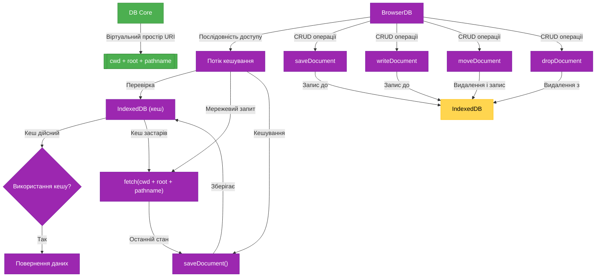
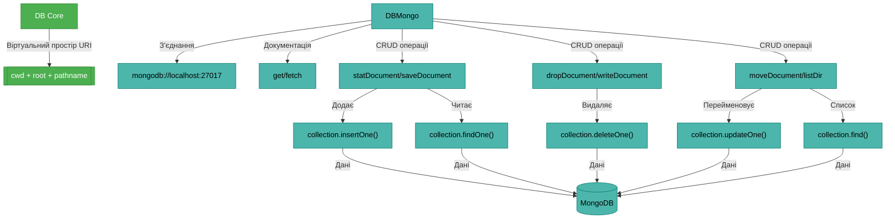
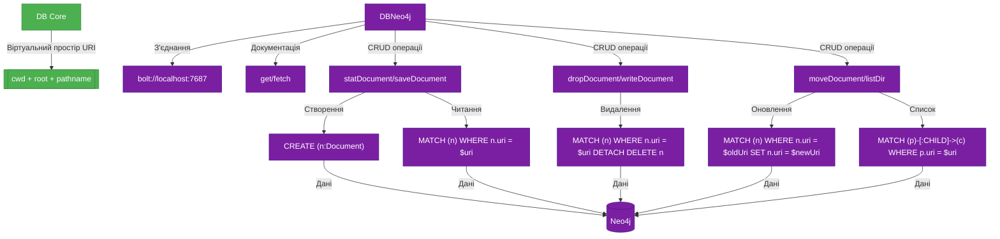
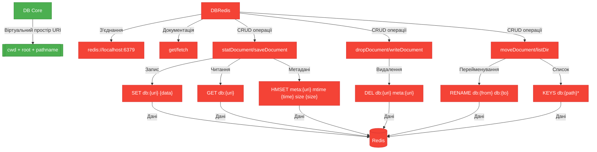

---
lang:
	code: en
	jsdoc: en
	chat: *
---
# NaN•Web DB системні інструкції

Кожні дані можуть стати твоєю базою знань.

## Клас DB та структура документів

Просто під'єднайте доступні дані, щоб керувати ними як своїми власними.

```js
import DB from "@nan0web/db-fetch"; // розширення абстрактного "@nan0web/db"
const db = new DB({ host: "https://en.wikipedia.org" });
const page = await db.get("/wiki/Main_Page");
```

Структуровані дані набагато легше перетворюються на інформацію.

Зміст головного каталогу `_.yaml`

```yaml
title: Мій Вебсайт
$content:
  - Header
  - Content
  - Contacts
  - Footer
$langs:
  - title: English
    locale: en-US
    href: /en/
  - title: Українська
    locale: uk-UA
    href: /uk/
```

Контейнер сторінки контактів `contacts.yaml`:

```yaml
main:
  company:
    address: вул. Перша, 17
    tel: +1234567890
```

Англомовний глобальний зміст `en/_.yaml`

```yaml
$baseHref: /en/
$content:
  - Header
  - Content
  - FreeConsultancy
  - Contacts
  - Footer
tags:
  - database
  - @nan0web/db
desc: Welcome to my nan•web/db website
```

Сторінка контактів `en/laconic.yaml`

```yaml
$content:
  - Content
  - Footer
```

Сторінка контактів `en/contacts.yaml`

```yaml
$ref: laconic
title: Мої контакти
desc: Зв'яжіться зі мною, коли у вас є питання або пропозиції
contact:
  $ref: /contacts#main/company
tags:
  - $keep: true
  - contact
  - information
```

Для такої простої структури ми вже маємо наступні функції:

Результат для `await db.fetch("en/contacts")` поєднується з ієрархії + глобальних змінних + змісту кожного батьківського каталогу

```yaml
$baseHref: /en/
$content:
  - Content
  - Footer
$langs:
  - title: English
    locale: en-US
    href: /en/
  - title: Українська
    locale: uk-UA
    href: /uk/
title: Мої контакти
desc: Зв'яжіться зі мною, коли у вас є питання або пропозиції
contact:
  address: вул. Перша, 17
  tel: +1234567890
tags:
  - database
  - @nan0web/db
  - contact
  - information
```

Якщо вам потрібен тільки конкретний файл, використовуйте `await db.loadDocument("en/contacts")` або `await db.loadDocument("en/_")`

Основні відносини та функції, доступні для базової бази даних:

1. `Наслідування` — батьківських і поточних глобальних змінних каталогів, що зберігаються за URI `/.*\/?_$/`, у файловій системі це можуть бути файли `_.nano` (`@nan0web/db-fs`) або `_.json` (`@nan0web/db-browser`) тощо. Для розширень `@nan0web/db-redis` або `@nan0web/db-mongo` розширення не мають змісту, але лише для документів даних. Двоїчні документи повинні завантажуватись і зберігатись як звичайні CRUD операції.
1. `Область видимості` — змінних на рівні каталогу і всіх підкаталогів, що зберігаються в `/.*\/?_\/.*/`.
1. `Розширення` — іншого документу через визначення властивості `$ref: [uri]` на верхньому рівні документу.
1. `Посилання` — на інші елементи через визначення властивості `$ref: [uri]` в будь-якій частині документу або як значення `someKey: "$ref:location.json#memorized/value"` (`uri = "location.json#memorized/value"`), окрім верхнього рівня, інакше це називається `розширенням`.

Всі `[uri]` є відносними до поточного документу, тому будуть розшифровані з поточного каталогу під час запиту даних.

## Ключові компоненти системи URI

### 1. `cwd` (Current Working Directory)
- **Що це**: Зовнішній контекст бази даних (хост або фізичний шлях)
- **Приклади**: `https://example.com`, `/var/www`, `redis://localhost:6379`
- **Призначення**: Визначає середовище, в якому працює база

### 2. `root` (Root Path)
- **Що це**: Внутрішній корінь/точка монтування бази
- **Приклади**: `content`, `api/v1`, `private`
- **Призначення**: Визначає початок шляху до ваших даних

### 3. `pathname` (Request Path)
- **Що це**: Відносний шлях запиту від кореня
- **Приклади**: `en/contacts.yaml`, `blog/post.md`
- **Призначення**: Вказує на конкретний ресурс у базі

Ідентифікація директорії - закінчується на слеш /.
Ідентифікація файла - не закінчується на слеш /.

### ✔️ **Правильна формула URI: `cwd + root + pathname`**
Ця формула є **основою системи** і не повинна бути змінена.

## Клас DB та структура документів

```js
import DB from "@nan0web/db-browser"
const db = new DB({ 
  cwd: "https://en.wikipedia.org", 
  root: "wiki",
  cache: true // Включаємо кешування в IndexedDB (відсутнє у базовому класі)
})
await db.connect()
const page = await db.get("Main_Page") // Використовує кеш, якщо налаштовано => https://en.wikipedia.org/wiki/Main_Page
```

## BrowserDB - реалізація для веб-браузера

BrowserDB повністю інтегрується з IndexedDB для локального зберігання даних. Це дозволяє:

1. Працювати без мережі (offline режим)
2. Прискорити доступ до часто використовуваних ресурсів
3. Зберігати стан даних між сеансами
4. Імплементувати редактор з можливістю бачити різницю між зміненою версією і серверною (як `git diff`)

### Конфігурація BrowserDB

```js
import DB from "@nan0web/db-browser"
const db = new DB({
  cwd: "https://api.example.com",
  root: "data",
  cache: true,        // Включити IndexedDB кеш
  dbName: "myapp-cache", // Назва бази даних в IndexedDB
  storeName: "documents", // Назва сховища
  ttl: 86400000,     // Час життя кешу (1 день в мс)
})
```

### BrowserDB API: Операції зберігання

```js
/**
 * Перевіряє наявність документа в кеші IndexedDB
 * @param {string} uri - URI документа
 * @returns {Promise<DocumentStat>}
 */
async statDocument(uri) {
  const db = await openDB(this.dbName, 1);
  const stat = await db.get(this.storeName, this.resolveSync(uri));
  return stat ? new DocumentStat(stat) : new DocumentStat();
}

/**
 * Зберігає документ у IndexedDB
 * @param {string} uri - URI документа
 * @param {any} document - Дані документа
 * @returns {Promise<boolean>}
 */
async saveDocument(uri, document) {
  const db = await openDB(this.dbName, 1);
  const key = this.resolveSync(uri);
  await db.put(this.storeName, {
    key,
    value: document,
    mtimeMs: Date.now(),
    size: JSON.stringify(document).length
  });
  return true;
}

/**
 * Видаляє документ з IndexedDB
 * @param {string} uri - URI документа
 * @returns {Promise<boolean>}
 */
async dropDocument(uri) {
  const db = await openDB(this.dbName, 1);
  await db.delete(this.storeName, this.resolveSync(uri));
  return true;
}

/**
 * Записує частину документа (стриймово)
 * @param {string} uri - URI документа
 * @param {string} chunk - Частина даних
 * @returns {Promise<boolean>}
 */
async writeDocument(uri, chunk) {
  const db = await openDB(this.dbName, 1);
  const key = this.resolveSync(uri);
  
  // Якщо документ вже існує, додаємо до існуючих даних
  const existing = await db.get(this.storeName, key);
  const newData = existing ? existing.value + chunk : chunk;
  
  await db.put(this.storeName, {
    key,
    value: newData,
    mtimeMs: Date.now(),
    size: newData.length
  });
  return true;
}

/**
 * Переміщує документ у кеші
 * @param {string} from - Вихідний URI
 * @param {string} to - Цільовий URI
 * @returns {Promise<boolean>}
 */
async moveDocument(from, to) {
  const db = await openDB(this.dbName, 1);
  const fromKey = this.resolveSync(from);
  const toKey = this.resolveSync(to);
  
  const data = await db.get(this.storeName, fromKey);
  if (data) {
    await db.put(this.storeName, {
      ...data,
      key: toKey
    });
    await db.delete(this.storeName, fromKey);
  }
  return true;
}
```

### Кешування в BrowserDB

Коли активовано кешування (`cache: true`), методи `get()` та `fetch()` працюють за наступною логікою:

```
Початок
  │
  ├── Запит → Чи є кеш для цього URI?
  │     │
  │     ├── Так → Отримати з IndexedDB
  │     │      │
  │     │      ├── Чи дійсний TTL кешу?
  │     │             │
  │     │             ├── Так → Повернути кешовані дані
  │     │             │
  │     │             └── Ні → Оновити з мережі
  │     │
  │     └── Ні → Отримати з мережі
  │
  └── Мережевий запит
        │
        └── Оновити кеш при успіху
```

## Архітектурні діаграми

### 1. DBBrowser з IndexedDB кешуванням



### 2. DBMongo з повною CRUD інтеграцією



### 3. DBNeo4j з графовою модельлю даних



Графові бази (як Neo4j) ідеально підходять для ієрархічних даних, подібних до файлової системи:

- **Відносини**: `:PARENT` і `:CHILD` відносини між вузлами (документами)
- **Ефективний пошук**: Запити з `STARTS WITH` для швидкого отримання ієрархії
- **Гнучкі зв'язки**: Природня підтримка механізму `$ref` через графові зв'язки

```js
// Реалізація listDir для Neo4j
async function listDir(uri) {
  const result = await this.session.run(
    `MATCH (p {path: $basePath})-[:CHILD]->(c)
     RETURN c.name AS name, c.mtimeMs AS mtimeMs, c.size AS size`,
    { basePath: `${this.root}/${uri}` }
  );
  // Формуємо DirectoryIndex з результату запиту...
}
```

Головна перевага графової бази — робота зі зв'язками між документами, що ідеально підходить для механізму посилань (`$ref`).


### 4. DBRedis з оптимізованими операціями



## Практичний приклад: BrowserDB з кешуванням

```js
import { DB } from "@nan0web/db-browser"

// Створюємо базу з кешуванням
const apiDB = new DB({
  cwd: "https://api.example.com",
  root: "v1",
  cache: true,
  dbName: "my-app",
  storeName: "api-cache"
})

await apiDB.connect()

// Завантажуємо дані - спочатку з кешу (якщо є), потім з мережі
const userProfile = await apiDB.get("users/profile")

// Здійснюємо локальну зміну
await apiDB.set("users/profile#preferences", { theme: "dark" })

// Зберігаємо оновлені дані (всі зміни)
await apiDB.push()

// Тепер приступаємо без мережі
navigator.onLine = false
const cachedProfile = await apiDB.get("users/profile") // Отримуємо з кешу

// Можемо витягнути частину бази
const userDB = apiDB.extract("users")
const usersData = await userDB.listDir() // Список користувачів з кешу
```


### Порівняння Стратегій Індексації

| База Даних | Механізм listDir | Переваги | Недоліки |
|------------|------------------|----------|----------|
| **FS (DBFS)** | `index.txt`/`index.jsonl` файли | - Мінімальна затримка<br>- Проста імплементація | - Потрібно оновлювати індекси при змінах |
| **Browser (DBBrowser)** | Завантаження `index.txt` з сервера | - Немає локального сканування<br>- Кешування через IndexedDB | - Залежність від мережі |
| **Redis (DBRedis)** | `KEYS {path}*` запит | - Висока швидкість<br>- Немає окремих файлів | - `KEYS` не рекомендовано в продуктиві |
| **MongoDB (DBMongo)** | `$regex` запит | - Природня інтеграція<br>- Можливість індексації | - Потребує налаштування індексів |
| **Neo4j (DBGraph)** | `STARTS WITH` запит | - Природня робота з ієрархією<br>- Ефективні зв'язки | - Вища складність моделювання |


## Чому комбінація `cwd + root + pathname` залишається критично важливою

1. **Чітке розділення контекстів**:
   - При зміні `cwd` (наприклад, зміна хосту API)
   - `root` залишається незмінним (структура API)
   - `pathname` адаптується до нового контексту

2. **Уніфікований інтерфейс для різних реалізацій**:
   ```js
   // Усі реалізації використовують одну логіку:
   const resolved = db.normalize(db.cwd, db.root, pathname);
   ```

3. **Коректна робота з `extract()`**:
   ```js
   const mainDB = new DB({ cwd: "https://example.com", root: "api/v1" });
   const usersDB = mainDB.extract("users");
   ```
   - `usersDB.root` = `api/v1/users/`
   - `usersDB.data` = дані тільки для `api/v1/users/**`

4. **Повна підтримка всіх CRUD операцій** через єдиний інтерфейс, що спирається на цю формулу

## Клас Directory

Каталоги не є обов'язковими для баз даних, але вони присутні за замовчуванням.

Кожен каталог може мати свій власний документ, який спільно використовується всіма дочірніми документами через функцію `Наслідування`. За замовчуванням це символ підкреслення `_` з можливими розширеннями, тому для бази даних файлової системи це може бути `_.json`, `_.yaml`, `_.yml`, `_.nano`, `_.csv`. У разі сховищ Redis, MongoDB або подібних, розширення можуть бути відсутні, тому дані каталогу будуть зберігатися як `_` або `en/_`. Також для таких баз даних можливе встановлення `Directory.File = "/"`, але це не тестовано.

Дані можуть зберігатися за допомогою різних завантажувачів та зберігачів, які визначаються шляхом перевизначення `loadDocument()` та `saveDocument()`.

```js
class Directory {
	static FILE = "_";
	static INDEX = "index";
	static DATA_EXTNAMES = [".json", ".yaml", ".yml", ".nano", ".csv"];
}
```

## Клас DirectoryIndex

Екземпляр індексу каталогу автоматично доповнює `entries: string[]`, що являє собою просто імена доступних вузлів (документів і каталогів), наприклад:

```json
{
	"$directory": {
		"maxEntriesOnLoad": 33,
		"entriesColumns": ["name", "mtimeMs.36", "size.36"]
	},
	"entries": [
		["about.json", "mecvlwg9", "8c"],
		["news/index.json", "mecvlwg9", "8c"],
		["products/index.json", "mecvlwg9", "8c"]
	]
}
```

Можливо зберігати індекси в різних форматах (рядки, текст, об'єкт, масив):

```json
{
	"$directory": {
		"maxEntriesOnLoad": 33,
		"entriesAs": "rows",
		"entriesColumns": ["name", "mtimeMs.36", "size.36"]
	},
	"entries": [
		"about.json mecvlwg9 8c",
		"news/index.json mecvlwg9 8c",
		"products/index.json mecvlwg9 8c"
	]
}
```

Можливо зберігати за посиланням:

```json
{
	"$directory": {
		"maxEntriesOnLoad": 33,
		"entriesAs": "text",
		"entriesColumns": ["name", "mtimeMs.36", "size.36"]
	},
	"entries": "$ref:index.txt"
}
```

```txt
about.json mecvlwg9 8c
news/index.json mecvlwg9 8c
products/index.json mecvlwg9 8c
```
